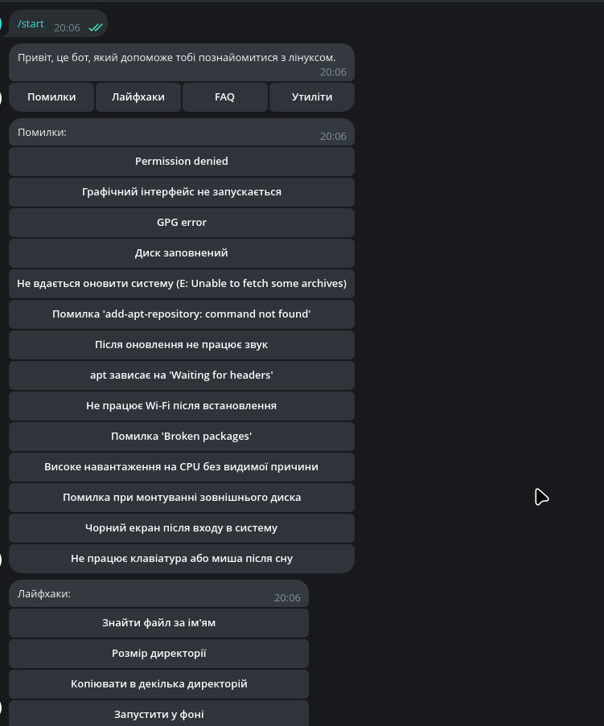
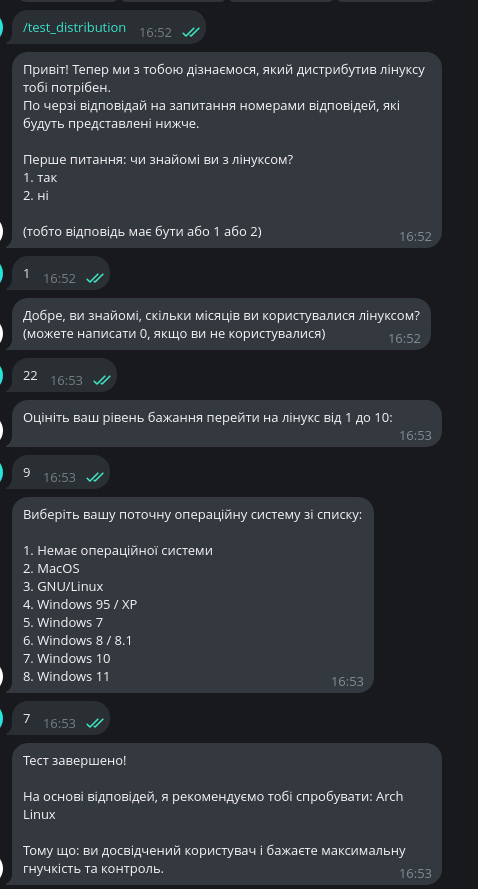

<h1>Linux Helper Bot</h1>
Це телеграм бот на пайтон написаний на бібліотеці aiogram. Бот допомогає перейти на операційну систему Linux і надає інструкцію щодо встановлення та налаштування.
також в ньому є проходження тесту, який допомагає визначити, який дистрибутив Linux найкраще підходить для користувача.
він дає лайфхаки, різні виправлення помилок та відповідає на поширені питання щодо Linux.
через нього можна звернутися до адміністратора та задати питання.
в ньому є штучний інтелект ChatGPT, який допомагає користувачам з різними питаннями щодо Linux.
ось декілька скріншотів бота:

    
    
    

